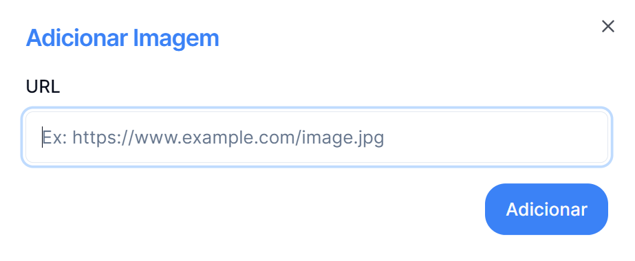

## Para adicionar Imagem, primeiro selecione o registo pretendido

_Clicar no registo pretendido_

---

## Na Página de detalhes clicar no Botão "Adicionar Imagem"

---

## No menu apresentado

### Deve colocar o URL da imagem pretendido.

### Pode concluir as alterações desejadas clicando no botão Adicionar ou voltar atrás através da seta no canto superior direito
