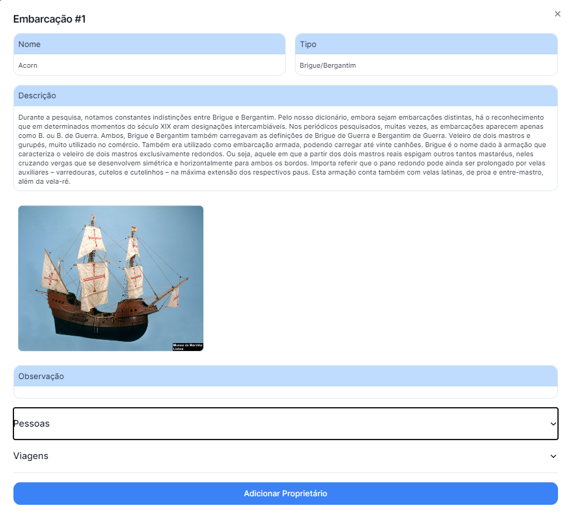
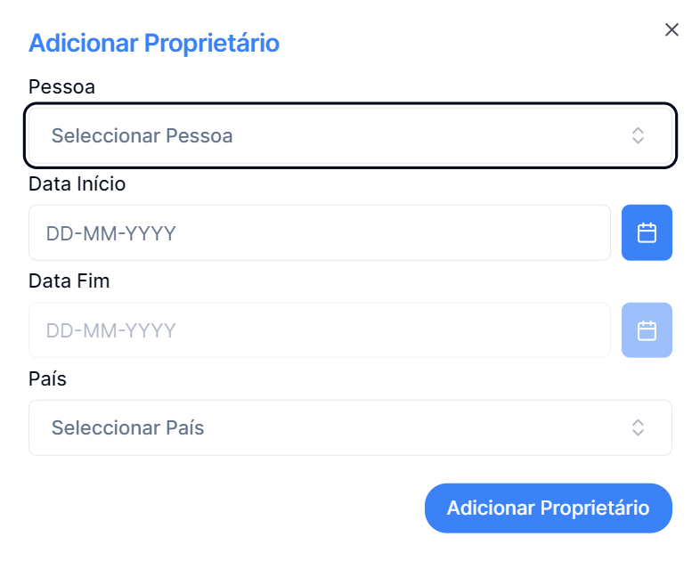

## Para adicionar Proprietário, primeiro selecione o registo pretendido

_Clicar no registo pretendido_

---

## Na página de detalhes clicar no botão "Adicionar Proprietário"

---

## No menu apresentado

### Deve selecionar a pessoa que pretende adicionar, preencher a datas em conformidade com o formato dos placeholders e selecionar um dos países possíveis registados

### Pode concluir as alterações desejadas clicando no botão Adicionar Proprietário ou voltar atrás através da seta no canto superior direito
