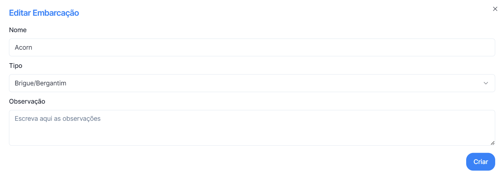

## Para editar o registo da Embarcação basta clicar no botão

_situado no lado direito dos registos_

---

## O Menu editar Embarcação permite editar os campos de Nome, escolher um tipo ou deixar uma Observação referente à embarcação.

### Para concluir basta clicar em **Criar**, ou para voltar a trás na cruz no topo direito.
