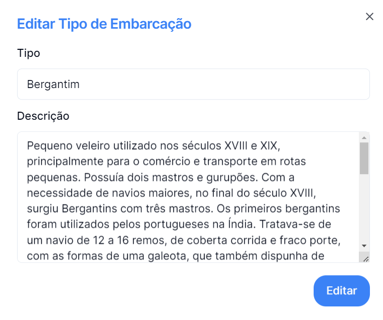

## Para editar o Tipo da Embarcação basta clicar no botão

_situado no lado direito dos registos_

---

## O Menu editar Tipo de Embarcação, permite alterar o Tipo e a Descrição

### Para concluir basta clicar em **Editar**, ou para voltar a trás na cruz no topo direito.
