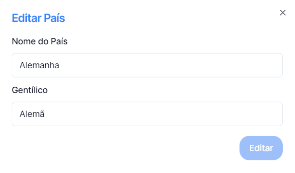

## Para editar o registo de um País basta clicar no botão

_situado no lado direito dos registos_

---

## O Menu editar Países, permite realizar alterações a um País já existente

### Para concluir basta clicar em **Editar**, ou para voltar a trás na cruz no topo direito.
