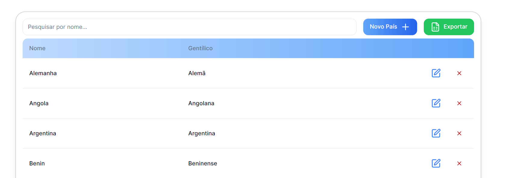

## O que se pode fazer nos Países?

### Consultar o registo de Países

## Tabela ->

- **Pesquisa:** Permite a Pesquisa através do Nome do País
- **Novo País:** Permite adicionar um novo País
- **Exportar:** Permite exportar os dados para Excel
- **Colunas:** Nome, Gentílico
- **Funções possíveis: ->** 
  &nbsp;&nbsp;&nbsp;&nbsp; - Editar Dados de um País 
