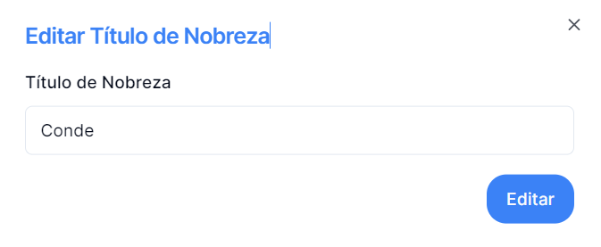

## Para editar um registo de Título já existe basta clicar no botão

_situado no lado direito dos registos_

---

## O Menu editar Título de Nobreza permite editar um Título já registado

### Para concluir basta clicar em **Editar**, ou para voltar a trás na cruz no topo direito.
