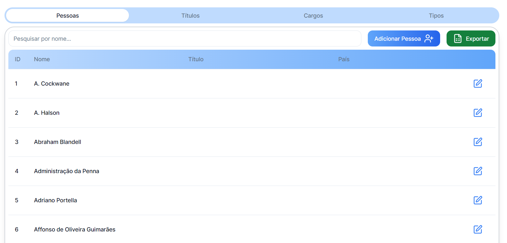
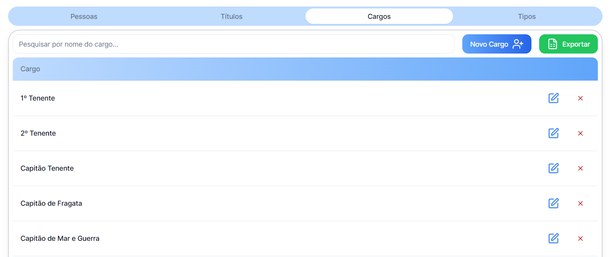

## O que se pode fazer na Página Pessoas?

### Consultas ->

### Realizadas através de três tabelas

{/* TABELA PESSOAS */}

## Tabela Pessoas ->

- **Pesquisa:** Permite a Pesquisa através do nome
- **Adionar Pessoa:** Permite adicionar uma nova pessoas
- **Exportar:** Permite exportar os dados para Excel
- **Colunas:** ID, Nome, Título de Nobreza e País
- **Funções possíveis: ->** 
  &nbsp;&nbsp;&nbsp;&nbsp; - Editar Dados de uma Pessoa 
  &nbsp;&nbsp;&nbsp;&nbsp; - Ao clicar, permite saber mais detalhes da embarcação 

### Detalhes da Pessoa ->

- **Detalhes:** 
  &nbsp;&nbsp;&nbsp;&nbsp; - Nome 
  &nbsp;&nbsp;&nbsp;&nbsp; - Título Nobreza associados 
  &nbsp;&nbsp;&nbsp;&nbsp; - Tabela de Cargo associados 
  &nbsp;&nbsp;&nbsp;&nbsp; - Tabela de Embarcações associados 
- **Adicionar Cargo:** Permite associar um Cargo à pessoa pretendida 

---

{/* TABELA  Títulos de Nobreza */}

## Tabela Títulos de Nobreza ->

- **Pesquisa:** Permite a Pesquisa através do título
- **Novo Título:** Permite adicionar uma novo Título de Nobreza
- **Exportar:** Permite exportar os dados para Excel
- **Colunas:** Título de Nobreza
- **Funções possíveis: ->** 
  &nbsp;&nbsp;&nbsp;&nbsp; - Editar Dados de um Título 
  &nbsp;&nbsp;&nbsp;&nbsp; - Eliminar um Título 
  &nbsp;&nbsp;&nbsp;&nbsp; - Ao clicar, permite saber mais detalhes sobre o título 

### Detalhes do Título ->

- **Detalhes:** 
  &nbsp;&nbsp;&nbsp;&nbsp; - Tabela de Pessoas com o Título escolhido, associado 

---

{/* TABELA  Títulos de Nobreza */}

## Tabela Cargos ->

- **Pesquisa:** Permite a Pesquisa através do nome do cargo
- **Novo Cargo:** Permite criar um novo Cargo
- **Exportar:** Permite exportar os dados para Excel
- **Colunas:** Cargo
- **Funções possíveis: ->** 
  &nbsp;&nbsp;&nbsp;&nbsp; - Editar Dados de um Cargo 
  &nbsp;&nbsp;&nbsp;&nbsp; - Eliminar um Cargo 
  &nbsp;&nbsp;&nbsp;&nbsp; - Ao clicar, permite saber mais detalhes sobre o Cargo 

### Detalhes do Cargo ->

- **Detalhes:** 
  &nbsp;&nbsp;&nbsp;&nbsp; - Tabela de Pessoas com o Cargo escolhido, associado 
