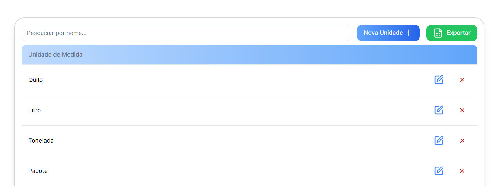

## O que se pode fazer em Unidades de Medida?

### Consulta o registo de Unidades de Medida

## Tabela ->

- **Pesquisa:** Permite a Pesquisa através do Nome da Unidade de Medida
- **Nova Unidade:** Permite adicionar uma nova Unidade de Medida
- **Exportar:** Permite exportar os dados para Excel
- **Colunas:** Unidade de Medida
- **Funções possíveis: ->** 
  &nbsp;&nbsp;&nbsp;&nbsp; - Editar Dados de uma Unidade de Medida 
