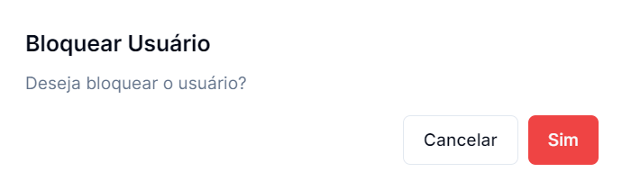
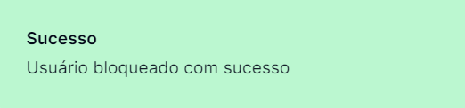

## Para bloquear um Usuário basta clicar no botão

_situado no lado direito dos registos_

---

## É questionado se tem a certeza do bloqueio

### Para concluir basta clicar em **Sim**, ou clicar em **Cancelar** para não avançar com a operação

---

## Se a operação for um sucesso recebe a mensagem

