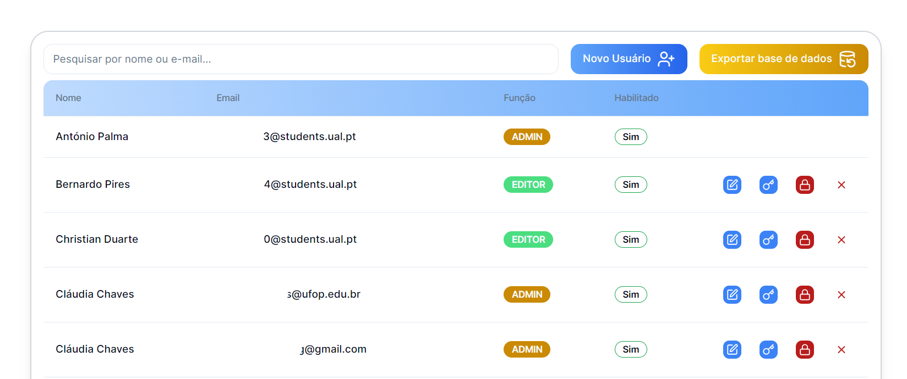

## O que se pode fazer em Usuários ?

### Consultar o registo de Usuários e realizar alterações

## Tabela ->

- **Pesquisa:** Permite a Pesquisa através do Nome ou Email do usuário
- **Novo usuário:** Permite adicionar um novo usuário
- **Colunas:** Nome, Email, Função, Habilitado e outros
- **Funções possíveis: ->** 
  &nbsp;&nbsp;&nbsp;&nbsp; - Editar Dados de um usuário 
  &nbsp;&nbsp;&nbsp;&nbsp; - Realizar o reset à password de um usuário 
  &nbsp;&nbsp;&nbsp;&nbsp; - Bloquear / Desbloquear um usuário 
  &nbsp;&nbsp;&nbsp;&nbsp; - Eliminar um Usuário 

---

- **Tipos de Usuários**

FALTA DIZER O QUE ELE PODE OU NAO FAZER

FALTA DIZER O QUE ELE PODE OU NAO FAZER
