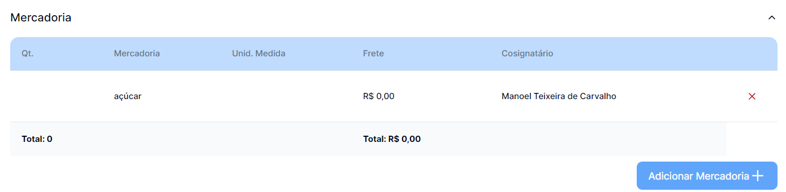
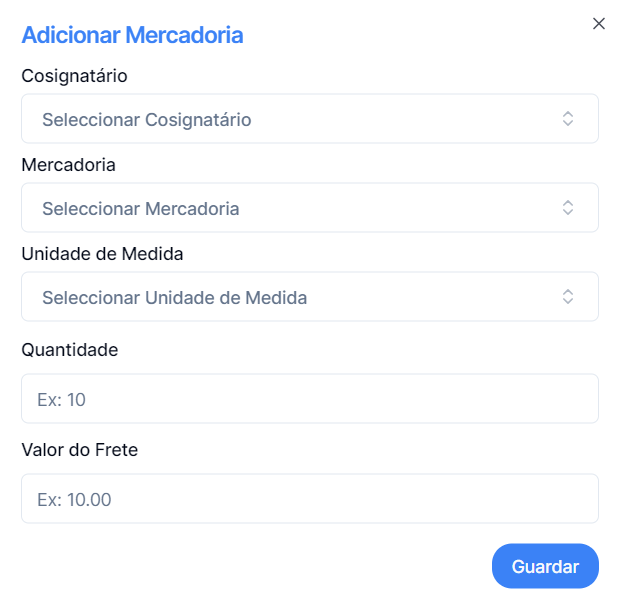

## Para Adicionar Mercadoria, primeiro selecione o registo pretendido

_Clicar no registo pretendido_

---

## Clique no Botão

---

## Preencha os dados na tabela

## Satisfeito com as alterações basta clicar Guardar

## E ficará registada

#### Ou para voltar a trás na cruz no topo direito.
