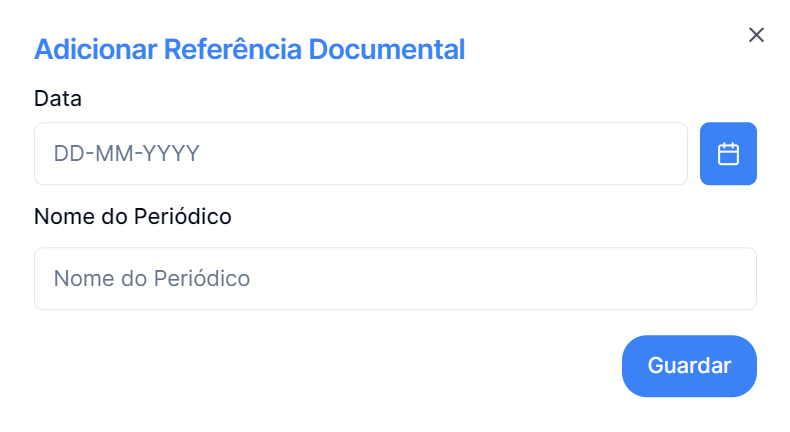

## Para Adicionar Referência Documental basta clicar no botão

---

## O menu Adicionar Arriba permite Adicionar uma Referência Documental com os seguintes dados

## Satisfeito com as alterações basta clicar Guardar

## E ficará registado

#### Ou para voltar a trás na cruz no topo direito.
