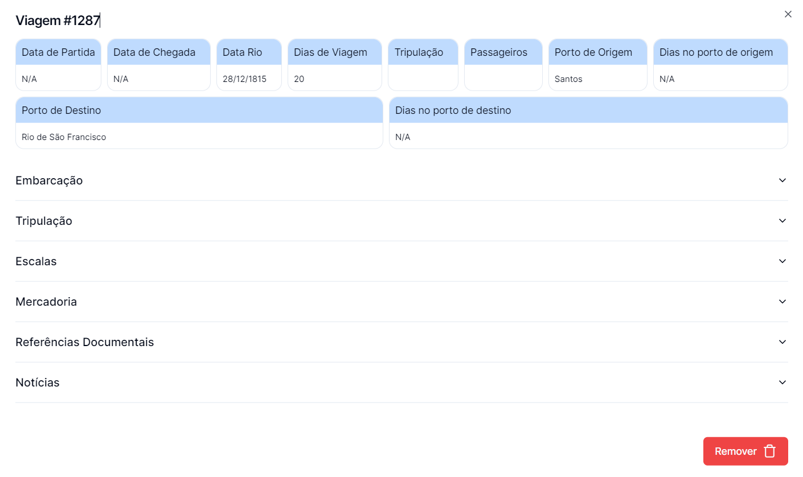

## O que se pode fazer nas Viagens?

### Consultar registo de Viagens e outras informações

## Tabela Viagens ->

- **Pesquisa:** Permite a Pesquisa através do Nome da Embarcação, através do ano (entre 1808 e 1830) e Tipo 'Sahida' ou 'Entrada'
- **Adionar Viagem:** Permite adicionar uma nova Viagem aos registos
- **Exportar:** Permite exportar os dados para Excel
- **Colunas:** ID, Data Rio, Tipo, Embarcação
- **Funções possíveis: ->** 
  &nbsp;&nbsp;&nbsp;&nbsp; - Editar Dados de uma Viagem 
  &nbsp;&nbsp;&nbsp;&nbsp; - Ao clicar no registo, permite saber mais detalhes sobre a Viagem 

---

### Detalhes da Viagem ->

_Aceder após clicar no registo pretendido_

- **Detalhes:** 
  &nbsp;&nbsp;&nbsp;&nbsp; - Página apresenta várias informações inicias como "Data de Partida" "Data de Chegada" "Tripulação" etc... Nos restantes menus é possível saber ainda mais detalhes e realizar alterações 
  &nbsp;&nbsp;&nbsp;&nbsp; - Embarcação (Permite saber vários detalhes sobre embarcação) 
  &nbsp;&nbsp;&nbsp;&nbsp; - Tripulação (Permite saber detalhes sobre a Tripulação) 
  &nbsp;&nbsp;&nbsp;&nbsp; - Escalas (Apresenta tabela com informações de escalar e permite **Adicionar Escala**) 
  &nbsp;&nbsp;&nbsp;&nbsp; - Mercadorias (Apresenta uma tabela com informações de mercadoria e permite **Adicionar Mercadoria**) 
  &nbsp;&nbsp;&nbsp;&nbsp; - Referências Documentais (Apresenta uma tabela com informações de Referências Documentais e permite **Adicionar Referências Documentais**) 
  &nbsp;&nbsp;&nbsp;&nbsp; - Notícias (Apresenta uma tabela com informações de Notícias e permite \*\*Adicionar Notícia\*\*) 
- **Remover:**  &nbsp;&nbsp;&nbsp;&nbsp; - Permite Remover a viagem dos registos 
